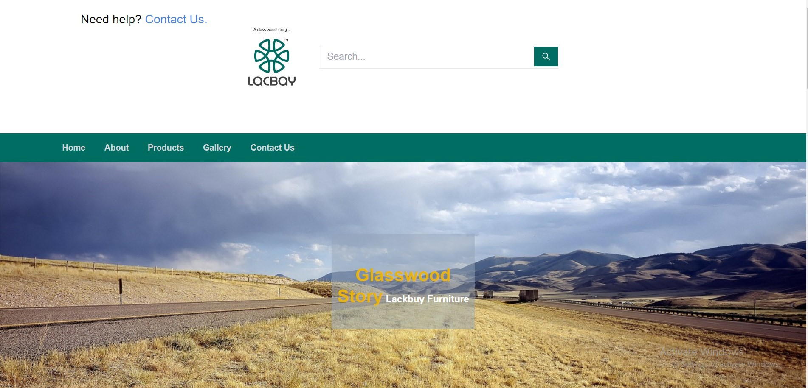

# Lackbay-Furniture website

## Description

Vite Project is a project built using Vite that focuses on [briefly describe the purpose or goal of the project]. It utilizes technologies and libraries to achieve [mention the key goals].

## Installation

Before starting, make sure Node.js and npm are installed on your machine.

```bash
# Clone the repository
git clone https://github.com/MuhammadShakkeer2030/lackbay-furniture-.git

# Navigate to the project directory
cd lackbay-furniture

# Install dependencies
npm install
```

## Usage

To run the development server:

```bash
npm run dev
```

To build the project:

```bash
npm run build
```

To lint the project:

```bash
npm run lint
```

To preview the project:

```bash
npm run preview
```

## Technologies Used

- **Frontend:**
  - React
  - React Router Dom
  - React Icons

- **Dev Dependencies:**
  - TypeScript
  - ESLint
  - Vite
  - Tailwind CSS

## Folder Structure

```plaintext
vite-project/
│
├── src/
│   ├── components/
│   ├── pages/
│   ├── App.tsx
│   └── index.tsx
│
├── public/
│   ├── index.html
│   └── ...
│
├── package.json
├── tsconfig.json
└── ...
```

